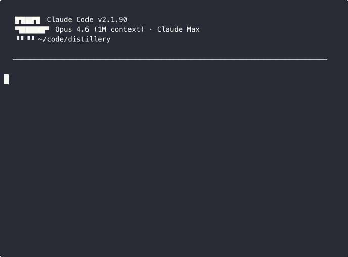

<p align="center">
  <picture>
    <source media="(prefers-color-scheme: dark)" srcset="docs/assets/distillery-logo-dark-512.png" width="180">
    <source media="(prefers-color-scheme: light)" srcset="docs/assets/distillery-logo-512.png" width="180">
    
  </picture>
</p>

<h1 align="center">Distillery</h1>

<!-- mcp-name: io.github.norrietaylor/distillery-mcp -->

<p align="center">
  <strong>Team Knowledge, Distilled</strong>
  <br>
  Capture, classify, connect, and surface team knowledge through conversational commands.
</p>

<p align="center">
  <a href="https://norrietaylor.github.io/distillery/">Documentation</a> &middot;
  <a href="#skills">Skills</a> &middot;
  <a href="#quick-start">Quick Start</a> &middot;
  <a href="https://norrietaylor.github.io/distillery/roadmap/">Roadmap</a> &middot;
  <a href="https://norrietaylor.github.io/distillery/presentation.html">Slides</a>
</p>

<p align="center">
  <a href="https://pypi.org/project/distillery-mcp/"></a>
  <a href="https://pypi.org/project/distillery-mcp/"></a>
  <a href="LICENSE"></a>
  <a href="https://www.python.org/downloads/"></a>
</p>

---
## What is Distillery?

Distillery is a team knowledge base accessed through Claude Code skills. It refines raw information from working sessions, meetings, bookmarks, and conversations into concentrated, searchable knowledge — stored as vector embeddings in DuckDB and retrieved through natural language. Runs locally over stdio or as a hosted HTTP service with GitHub OAuth for team access.

Distillery captures the highest-value transformation — from noise to signal — and makes it a tool the whole team can use.

> **Full documentation:** [norrietaylor.github.io/distillery](https://norrietaylor.github.io/distillery/)

<p align="center">
  
</p>

## Skills

Distillery provides 10 Claude Code slash commands:

| Skill | Purpose | Example |
|-------|---------|---------|
| `/distill` | Capture session knowledge with dedup detection | `/distill "We decided to use DuckDB for local storage"` |
| `/recall` | Semantic search with provenance | `/recall distributed caching strategies` |
| `/pour` | Multi-entry synthesis with citations | `/pour how does our auth system work?` |
| `/bookmark` | Store URLs with auto-generated summaries | `/bookmark https://example.com/article #caching` |
| `/minutes` | Meeting notes with append updates | `/minutes --update standup-2026-03-22` |
| `/classify` | Classify entries and triage review queue | `/classify --inbox` |
| `/watch` | Manage monitored feed sources | `/watch add github:duckdb/duckdb` |
| `/radar` | Ambient feed digest with source suggestions | `/radar --days 7` |
| `/tune` | Adjust feed relevance thresholds | `/tune relevance 0.4` |
| `/setup` | Onboarding wizard for MCP connectivity and config | `/setup` |

## Quick Start

### Step 1: Install the Plugin

```bash
claude plugin marketplace add norrietaylor/distillery
claude plugin install distillery
```

This installs all 10 skills. The plugin defaults to a hosted demo server — you can start using Distillery immediately.

> **Demo Server:** `distillery-mcp.fly.dev` is for evaluation only. Do not store sensitive or confidential data.

### Step 2: Switch to Local with uvx (Recommended)

For a private knowledge base, run the MCP server locally with `uvx` — no persistent install needed:

```bash
# Get a free API key from jina.ai, then:
export JINA_API_KEY=jina_...
```

Add to `~/.claude/settings.json` (overrides the plugin's demo server):

```json
{
  "mcpServers": {
    "distillery": {
      "command": "uvx",
      "args": ["distillery-mcp"],
      "env": {
        "JINA_API_KEY": "${JINA_API_KEY}"
      }
    }
  }
}
```

Restart Claude Code and run the onboarding wizard:

```
/setup
```

See the [Local Setup Guide](https://norrietaylor.github.io/distillery/getting-started/local-setup/) for full configuration options, or [deploy your own instance](https://norrietaylor.github.io/distillery/team/deployment/) for team use.

## Development

```bash
uv pip install -e ".[dev]"
# or
pip install -e ".[dev]"
pytest                              # run tests
mypy --strict src/distillery/       # type check
ruff check src/ tests/              # lint
```

See [Contributing](https://norrietaylor.github.io/distillery/contributing/) for the full guide.

## License

Apache 2.0 — see [LICENSE](LICENSE) for details.
