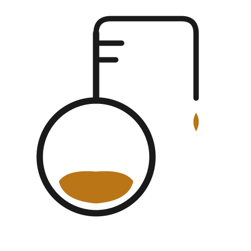

<p align="center">
  <picture>
    <source media="(prefers-color-scheme: dark)" srcset="docs/assets/distillery-logo-dark-512.png" width="180">
    <source media="(prefers-color-scheme: light)" srcset="docs/assets/distillery-logo-512.png" width="180">
    
  </picture>
</p>

<h1 align="center">Distillery</h1>

<p align="center">
  <strong>A team-accessible Second Brain powered by Claude Code</strong>
  <br>
  Capture, classify, connect, and surface team knowledge through conversational commands.
</p>

<p align="center">
  <a href="https://norrietaylor.github.io/distillery/">Documentation</a> &middot;
  <a href="#skills">Skills</a> &middot;
  <a href="#quick-start">Quick Start</a> &middot;
  <a href="https://norrietaylor.github.io/distillery/roadmap/">Roadmap</a> &middot;
  <a href="https://norrietaylor.github.io/distillery/presentation.html">Slides</a>
</p>

---

## What is Distillery?

Distillery is a team knowledge base accessed through Claude Code skills. It refines raw information from working sessions, meetings, bookmarks, and conversations into concentrated, searchable knowledge — stored as vector embeddings in DuckDB and retrieved through natural language. Runs locally over stdio or as a hosted HTTP service with GitHub OAuth for team access.

Inspired by Tiago Forte's **Building a Second Brain** methodology (CODE: Capture, Organize, Distill, Express), Distillery maps the "Distill" step — the highest-value transformation from noise to signal — into a tool the whole team can use.

> **Full documentation:** [norrietaylor.github.io/distillery](https://norrietaylor.github.io/distillery/)

## Skills

Distillery provides 10 Claude Code slash commands:

| Skill | Purpose | Example |
|-------|---------|---------|
| `/distill` | Capture session knowledge with dedup detection | `/distill "We decided to use DuckDB for local storage"` |
| `/recall` | Semantic search with provenance | `/recall distributed caching strategies` |
| `/pour` | Multi-entry synthesis with citations | `/pour how does our auth system work?` |
| `/bookmark` | Store URLs with auto-generated summaries | `/bookmark https://example.com/article #caching` |
| `/minutes` | Meeting notes with append updates | `/minutes --update standup-2026-03-22` |
| `/classify` | Classify entries and triage review queue | `/classify --inbox` |
| `/watch` | Manage monitored feed sources | `/watch add github:duckdb/duckdb` |
| `/radar` | Ambient feed digest with source suggestions | `/radar --days 7` |
| `/tune` | Adjust feed relevance thresholds | `/tune relevance 0.4` |
| `/setup` | Onboarding wizard for MCP connectivity and config | `/setup` |

## Quick Start

### Plugin Install (Recommended)

```bash
claude plugin marketplace add norrietaylor/distillery
claude plugin install distillery
```

Verify the connection:

```
distillery_status
```

### Local Setup

```bash
git clone https://github.com/norrietaylor/distillery.git
cd distillery
pip install -e .
```

See the [Local Setup Guide](https://norrietaylor.github.io/distillery/getting-started/local-setup/) for configuration and MCP server connection.

## Development

```bash
pip install -e ".[dev]"
pytest                              # run tests
mypy --strict src/distillery/       # type check
ruff check src/ tests/              # lint
```

See [Contributing](https://norrietaylor.github.io/distillery/contributing/) for the full guide.

## License

Apache 2.0 — see [LICENSE](LICENSE) for details.
