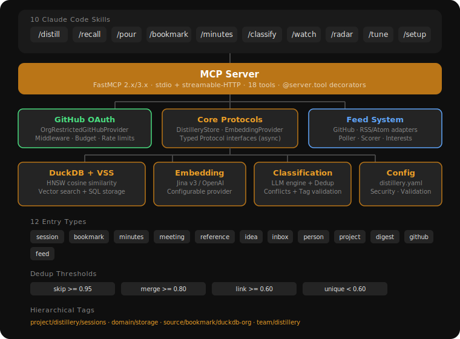

# Distillery

**Team Knowledge, Distilled**

Distillery is a team knowledge base accessed through [Claude Code](https://claude.ai/code) skills. It refines raw information from working sessions, meetings, bookmarks, and conversations into concentrated, searchable knowledge — stored as vector embeddings in [DuckDB](https://duckdb.org/) and retrieved through natural language.

Runs locally over stdio or as a hosted HTTP service with GitHub OAuth for team access.

## Who is Distillery for?

- **Developers and teams** who use Claude Code and want to capture, organize, and retrieve knowledge without leaving their workflow.
- **Team leads and operators** who want a shared knowledge base their team can access through a hosted MCP server with GitHub authentication.
- **Anyone building a Second Brain** — inspired by Tiago Forte's [Building a Second Brain](https://www.buildingasecondbrain.com/) methodology (CODE: Capture, Organize, Distill, Express), Distillery maps the "Distill" step into a tool the whole team can use.

## Skills

Distillery provides 10 Claude Code slash commands:

| Skill | Purpose | Example |
|-------|---------|---------|
| [`/distill`](skills/distill.md) | Capture session knowledge with dedup detection | `/distill "We decided to use DuckDB for local storage"` |
| [`/recall`](skills/recall.md) | Semantic search with provenance | `/recall distributed caching strategies` |
| [`/pour`](skills/pour.md) | Multi-entry synthesis with citations | `/pour how does our auth system work?` |
| [`/bookmark`](skills/bookmark.md) | Store URLs with auto-generated summaries | `/bookmark https://example.com/article #caching` |
| [`/minutes`](skills/minutes.md) | Meeting notes with append updates | `/minutes --update standup-2026-03-22` |
| [`/classify`](skills/classify.md) | Classify entries and triage review queue | `/classify --inbox` |
| [`/watch`](skills/watch.md) | Manage monitored feed sources | `/watch add github:duckdb/duckdb` |
| [`/radar`](skills/radar.md) | Ambient feed digest with source suggestions | `/radar --days 7` |
| [`/tune`](skills/tune.md) | Adjust feed relevance thresholds | `/tune relevance 0.4` |
| [`/setup`](skills/setup.md) | Onboarding wizard for MCP connectivity and config | `/setup` |

## Quick Start

The fastest way to get started:

```bash
# Install the plugin (all 10 skills + MCP connection)
claude plugin marketplace add norrietaylor/distillery
claude plugin install distillery
```

Then verify the connection by calling the `distillery_status` MCP tool:

```
distillery_status
```

For other installation options, see [Plugin Install](getting-started/plugin-install.md) or [Local Setup](getting-started/local-setup.md).

## Architecture at a Glance

<picture>
  
</picture>

Distillery is built as a 4-layer system:

| Layer | What it does |
|-------|-------------|
| **Skills** | 10 SKILL.md files — portable, version-controlled slash commands |
| **MCP Server** | 22 tools over stdio (local) or HTTP (team), built on FastMCP 2.x |
| **Core Protocols** | `DistilleryStore`, `EmbeddingProvider`, `ClassificationEngine` — typed Protocol interfaces |
| **Backends** | DuckDB + VSS for vector search, Jina/OpenAI for embeddings |

See [Architecture](architecture.md) for the full design.

## License

Apache 2.0 — see [LICENSE](https://github.com/norrietaylor/distillery/blob/main/LICENSE) for details.
